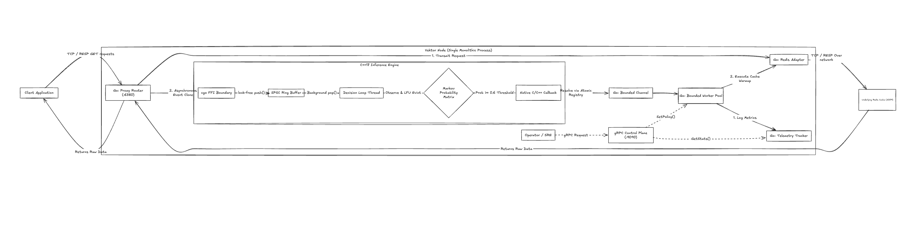

# Vektor

Vektor is a high-throughput, latency-optimized predictive prefetch engine for Redis. Built as a transparent RESP proxy, it utilizes a C++17 Markov Chain inference model to predict subsequent key access patterns and proactively materializes data into the cache ahead of client requests.

## Architecture



The system is decoupled across an FFI (Foreign Function Interface) boundary to maximize throughput and isolate GC (Garbage Collection) overhead:

- **Proxy Layer (Go):** A concurrent TCP router implementing custom RESP parsing. It multiplexes client database requests downstream to Redis while asynchronously cloning access telemetry.
- **Inference Engine (C++17):** A deterministic prediction engine bounding an LFU-evicted Markov Chain. State transitions and predictability probabilities are processed sequentially by a dedicated background thread.
- **Cross-Language IPC:** Telemetry is forwarded from Go to C++ via a Single-Producer Single-Consumer (SPSC) Ring Buffer.
- **Coordinator Pool:** Predictions exceeding the operational threshold fire native CGO callbacks back into buffered Go channels. Load is shed utilizing bounded Goroutine worker scaling.
- **Control Plane:** An internal gRPC server exposing operational analytics and dynamic tuning.

## Internals

- **Monolithic State over Distributed Gossip:** Vektor intentionally eschews horizontal network distribution and gossip protocols. Sharing Markov probability matrices across a cluster introduces microsecond serialization limits and eventual consistency fragmentation, physically destroying the sub-200ns prediction bounds required for valid cache warming.
- **Stochastic Prefetching:** Markov Chain probability matrices dictate cache ingestion over static heuristics (e.g. LRU).
- **Lock-Free Concurrency:** `std::atomic` primitives and `memory_order_acquire`/`release` semantics eliminate OS-level thread blocking across execution boundaries.
- **Cache-Line Alignment:** 64-byte `alignas(64)` padding prevents false sharing contention across physical CPU cache lines.
- **FFI Pointer Registration:** Thread-safe atomic maps bridge Go GC environments with unmanaged C++ process boundaries, safely bypassing `cgocheck` panics.
- **Wire-Level Interception:** Direct TCP packet multiplexing and manual parsing of raw RESP payload frames.
- **Deterministic Validation:** Clang Thread Sanitizer (TSAN) compilation mathematically bounds execution loops to guarantee data-race freedom.

## Usage

### Dependencies
- Go 1.22+
- Clang (C++17)
- Docker / Docker Compose

### Starting the Environment
Launch the Vektor ecosystem (Proxy, Coordinator, and backing Redis node) via Docker Compose:
```bash
make run
```

### Connecting Clients
Applications interface with Vektor exactly as they would a standard Redis node. Divert standard Redis clients to the proxy port:
```bash
redis-cli -p 6380
```

### Telemetry & Tuning
Administrators can interact with the dynamic gRPC Control Plane on port `9090` without interrupting active proxy traffic:
```bash
grpcurl -plaintext localhost:9090 vektor.ControlPlane/GetStats
```

## Build Targets
- `make build`: Compiles proxy nodes and dynamically links C++ shared libraries.
- `make test`: Executes TSAN-verified C++ tests and localized Go network suites.
- `make proto`: Regenerates gRPC and Protobuf bindings.
- `make bench`: Executes custom trace replay simulations extracting baseline latency distributions.

## Further Reading
- [Prediction model research](docs/prediction-model-research.md): open-source alternatives to the current first-order Markov predictor, with rollout guidance for Vektor's latency constraints.
